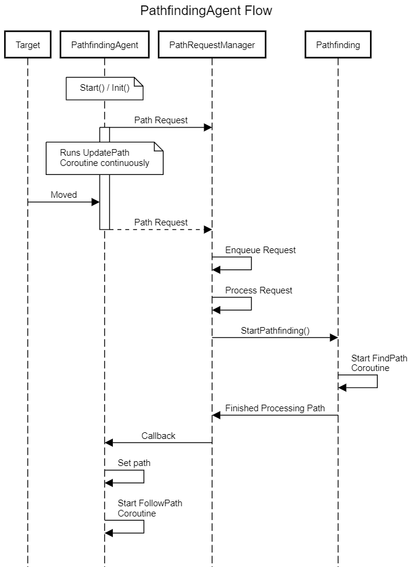

# Pathfinding

Work in progress Pathfinding system for Unity. Plan is to make it toggleable between 2D and 3D. Heavily inspired by Sebastian League's Pathfinding Series.

## How it works

The PathfindingGrid class generates a grid by a size that can be determined. Gizmos help visualize the area of the grid. The Grid monobehaviour has 2 other required components, the Pathfinding class which is the A* Pathfinding algorithm and the PathRequestManager which is the manager in charge of processing incoming PathfindingAgent path requests.

Essentially the a Pathfinding Manager component can exist in a scene and is composed of a PathfindingGrid, a PathRequestManager and the Pathfinding algorithm and acts as a central hub for all Agent incoming requests.

### PathfindingAgent

The pathfinding agent is essentially a "seeker". It has a Target reference and will attempt to follow the path after requesting it from the PathRequestManager.

## Known Issues

- ❗ Path request on Target move in 2D makes the Agent unit's speed uncontrollable
- 🚧 3D is partially implemented and has many bugs

## Planned Features

- Initializer method on PathfindingAgent's to avoid them starting on Start
- Path break when Target leaves path activation radius
- Other PathfindingAgent collision avoidance
- Custom Editors for ScriptableObject configuration classes & Pathfinding Classes for better UX/DX